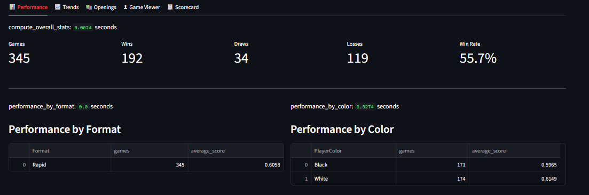
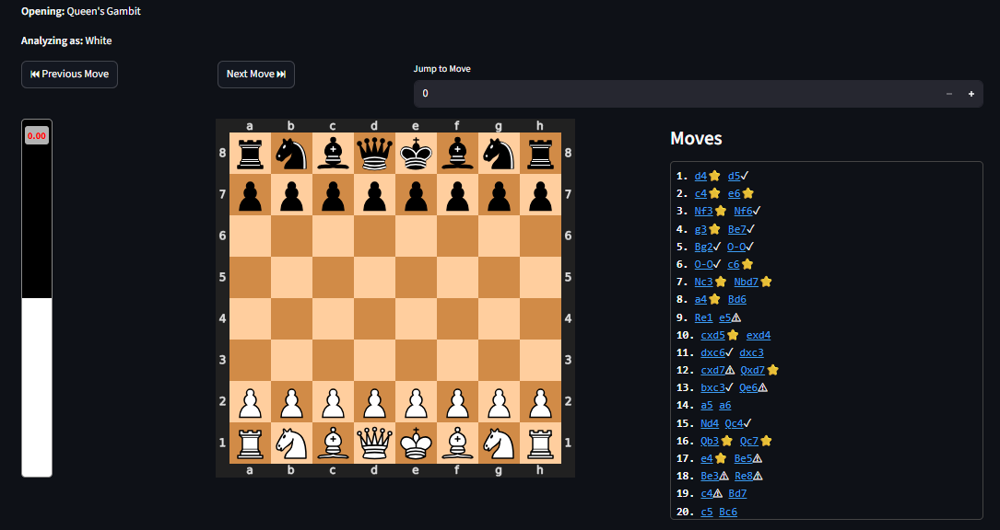
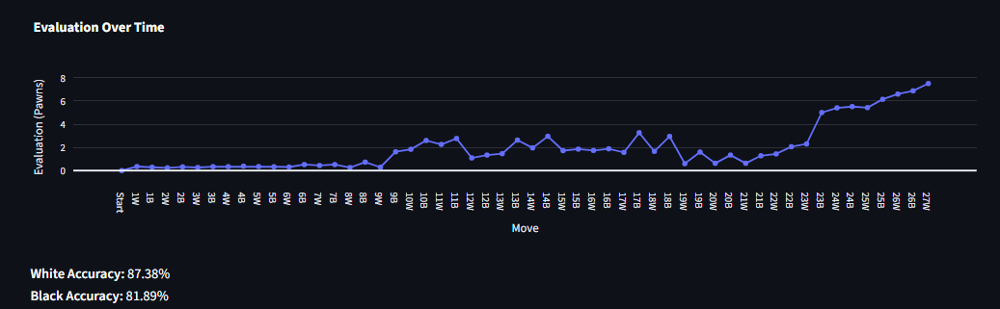
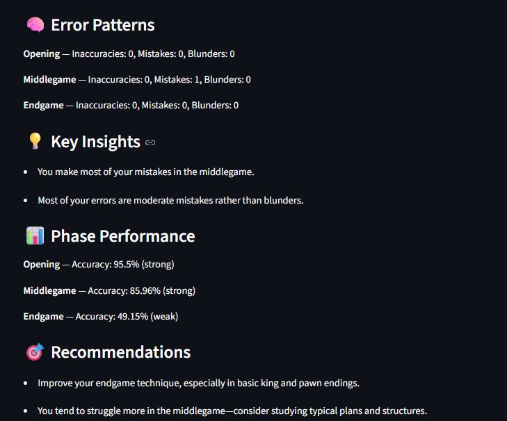
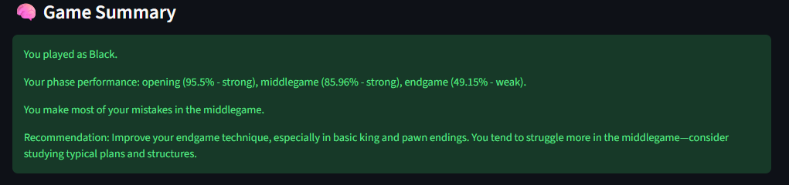

# ♟️ Chess Performance Analytics

A chess analytics web application that transforms raw game data into **actionable performance insights** using engine evaluation and behavioral pattern detection.

---

## 🚀 Live Demo

(https://chess-analytics.streamlit.app/)

---

## 🧠 Overview

Most chess tools analyze moves.

This project goes further — it analyzes the **player**.

It identifies:

* Where you make mistakes
* Which phase you struggle in
* What you should improve

---

## ✨ Key Features

### 🔍 Game Analysis

* PGN upload and Chess.com integration
* Engine-powered evaluation using Stockfish
* Move classification (best, mistake, blunder, etc.)

---

### 📊 Performance Analytics

* Win / draw / loss statistics
* Performance by color
* Rating-based analysis
* Time-based filtering

---

### 🧠 Intelligence Layer (Core Feature)

* Phase-wise accuracy (Opening, Middlegame, Endgame)
* Error pattern detection
* Insight generation (player weaknesses)
* Player-specific analysis

---

### 🎯 Coaching System

* Personalized recommendations
* Tactical and positional feedback
* Blunder analysis

---

### 🧾 Game Summary

* Auto-generated performance report
* Combines insights, accuracy, and recommendations
* Provides clear improvement direction

---

## 🖥️ Tech Stack

* Python
* Streamlit
* python-chess
* Stockfish
* Plotly
* Pandas

---

## 📸 Screenshots

### Dashboard



### Game Viewer



### Evaluation Graph



### Insights & Recommendations



### Game Summary



---

## ⚙️ Setup Instructions

### 1. Clone repository

```bash
git clone https://github.com/SanidhyaSood314/chess-performance-analytics.git
cd chess-performance-analytics
```

---

### 2. Install dependencies

```bash
pip install -r requirements.txt
```

---

### 3. Install Stockfish

Download from: https://stockfishchess.org/download/

Ensure it is accessible via:

```bash
stockfish
```

---

### 4. Run app

```bash
streamlit run app.py
```

---

## 💡 Key Idea

This project focuses on:

👉 Converting engine evaluations into player insights
👉 Identifying weaknesses
👉 Providing actionable improvement strategies

---

## 🚧 Future Improvements

* ECO-based opening detection
* Blunder heatmap
* Player style classification
* Advanced coaching system

---
